Bioassay Experiment
================
Corrie
5/29/2019

``` r
library(MASS)
library(ggplot2)
library(mvtnorm)
library(dplyr)
library(cowplot)
```

This example is a nonconjugate model for a bioassay experiment. It is a
two-parameter example from the class of generalized linear models. Here,
we use a simulation grid-approximation approach to get the posterior
distribution.

## The data

To test how toxic a drug is, it is often given to animals at various
doses and then observed how many have adverse outcomes. Often, the
response is simply a dichothomous outcome: animal alive or dead. An
example of such data:

``` r
d <- data.frame(log.dose=c(-0.86, -0.3, -0.05, 0.73),
                n.animals=c(5,5,5,5),
                n.deaths=c(0,1,3,5))
d %>% knitr::kable()
```

| log.dose | n.animals | n.deaths |
| -------: | --------: | -------: |
|   \-0.86 |         5 |        0 |
|   \-0.30 |         5 |        1 |
|   \-0.05 |         5 |        3 |
|     0.73 |         5 |        5 |

``` r
d <- d %>%
  mutate(prop=n.deaths / n.animals) 
d %>%
  ggplot(aes(x=log.dose, y=prop)) +
  geom_point(col="#E41A1C") +
  theme_minimal() +
  labs(y="Proportion of deaths",
       x="Dose (log g/ml")
```

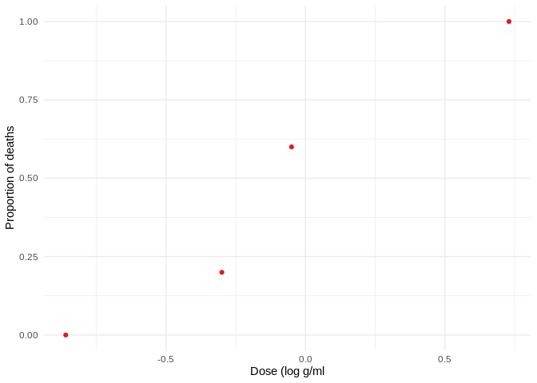<!-- -->

## The model

It is reasonable to model the outcomes of the five animals *within each
group* as exchangeable and independent. The data points
=`n.deaths` are
then binomially distributed:   
")  
where  is the
number of animals (in this example it is 5 for each group).

We model the response
 by
the dose using a linear model together with a logit-link:   
  = \\alpha + \\beta x_i")  
This is called a logistic regression model.

## A frequentist approach

To get a rough estimate around where we should plot our grid, we first
compute the maximum likelihood estimate using the standard logistic
regression
tools.

``` r
d.notagg <- data.frame(log.dose=c(rep(-0.86, 5), rep(-0.3,5), rep(-0.05,5), rep(0.73,5) ),
                death=c(rep(0,5), 1, rep(0,4), rep(1, 3), 0, 0, rep(1, 5)) )

fit <- glm(death ~ 1 + log.dose,
          data=d.notagg,
          family="binomial")

summary(fit)
```

``` 

Call:
glm(formula = death ~ 1 + log.dose, family = "binomial", data = d.notagg)

Deviance Residuals: 
     Min        1Q    Median        3Q       Max  
-1.37756  -0.64102  -0.07708   0.05473   1.83495  

Coefficients:
            Estimate Std. Error z value Pr(>|z|)
(Intercept)   0.8466     1.0191   0.831    0.406
log.dose      7.7488     4.8727   1.590    0.112

(Dispersion parameter for binomial family taken to be 1)

    Null deviance: 27.526  on 19  degrees of freedom
Residual deviance: 11.789  on 18  degrees of freedom
AIC: 15.789

Number of Fisher Scoring iterations: 7
```

The estimate is  = (0.85, 7.75)") with standard errors
of 1.0 and 4.9 for
 and
,
respectively.

# Approximating the posterior using a grid

First, we define some functions.

``` r
logit <- function(x) log(x / (1-x) )
invlogit <- function(x) exp(x) / (1 + exp(x))
```

We compute the log posterior using the log likelihood. This helps to
avoid numerical problems. Simplifying some of the expressions, we get
the following function for the log likelihood:

``` r
log.lkhd <- function(alpha, beta) {
  lin <- alpha + beta * d$log.dose
  y <- d$n.deaths; n <- d$n.animals
  sum( y*(lin - log( 1 + exp(lin ) )) + ( n-y )*(-log(1 + exp(lin))) )
}
```

Next, we define a prior function. Since we use a uniform prior, we just
define a constant function:

``` r
prior <- function(alpha, beta) {
  1
}
```

Next, we define our grid and a function to compute the posterior:

``` r
grid_size <- 100
alpha_seq <- seq(-5, 10, length.out=grid_size)
beta_seq <- seq(-10, 40, length.out=grid_size)

alpha_width <- alpha_seq[2] - alpha_seq[1]
beta_width <- beta_seq[2] - beta_seq[1]

post.grid <- expand.grid(alpha = alpha_seq, 
                         beta = beta_seq ) 

posterior.grid <- function(grid, prior_fun=prior) {
  grid %>%
  rowwise %>%
  mutate(loglkhd = log.lkhd(alpha, beta),
         prior = prior_fun(alpha, beta)) %>%
  mutate(log.post = loglkhd + log(prior) ) %>%
  ungroup() %>%
  mutate(log.postm = log.post - max(log.post),
         un.post = exp(log.postm),
         # normalize the posterior
         post = un.post / sum(un.post),
         prior = prior / sum(prior) ) %>%
    select(-log.postm, -un.post)
}
```

Now, we compute the posterior:

``` r
post.grid <- posterior.grid(post.grid)
```

We can plot the posterior density as contour lines. To get the right
contour lines, we use the mode and multiply it with 0.05, 0.1, 0.15, …,
0.95.

``` r
mode <- max(post.grid$post)
breaks <- seq(0.05, 0.95, by=0.1) * mode

unf_post_plot <- post.grid %>%
  ggplot(aes(x=alpha, y=beta, z=post)) + 
  stat_contour(breaks=breaks, col="#377EB8") +
  ylim(-10, 40) +
  scale_x_continuous(breaks=c(-4, -2, 0, 2, 4, 6, 8, 10), 
                     limits = c(-5, 10)) +
  theme_minimal() +
  labs(title="Posterior density", subtitle = "with uniform prior")
unf_post_plot
```

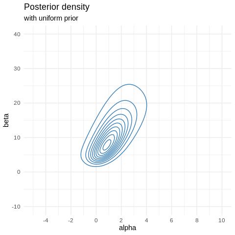<!-- -->

## Sampling from the posterior

To sample from the posterior, we take the following steps:

1.  Compute the marginal posterior distribution of
    
    by numerically summing over
    :

<!-- end list -->

``` r
marg.alpha <- post.grid %>%
  group_by(alpha) %>%
  summarise(post = sum(post)) %>%
  pull(post)
```

2.  For  (or more if you want to have more samples),

<!-- end list -->

1)  Draw samples from "):

<!-- end list -->

``` r
N <- 1000
alpha.sample <- sample(seq(-5, 10, length.out = 100), N, replace=T, prob=marg.alpha)
```

2)  Draw  from the discrete conditional distribution ") given the just-sampled value of
    :

<!-- end list -->

``` r
beta.sample <- c()
for(i in 1:N) {
  cond.beta <- post.grid %>%
    filter(alpha == alpha.sample[i]) %>%
    mutate(post = post / sum(post)) %>%
    pull(post)
  bsamp <- sample(seq(-10, 40, length.out = 100), 1, prob=cond.beta)
  beta.sample[i] <- bsamp
}
```

3)  For each of the sampled
    
    and , add a uniform random jitter, centered at zero with a
    width equal to the spacing of the sampling grid, This gives the
    simulation draws a continuous distribution:

<!-- end list -->

``` r
# add random jitter
alpha.sample <- alpha.sample + runif(N, min = 0 - alpha_width/2,
                                        max = 0 + alpha_width/2)
beta.sample <- beta.sample + runif(N, min = 0 - beta_width/2, 
                                      max = 0 + beta_width/2 )
```

The whole thing as a function:

``` r
extract.sample <- function(density.grid, N=1000, prior=FALSE) {
  if (prior) {
    density.grid <- density.grid %>%
      select(alpha, beta, post=prior)
  } else {
    density.grid <- density.grid %>%
      select(alpha,  beta, post)
  }
  marg.alpha <- density.grid %>%
  group_by(alpha) %>%
  summarise(post = sum(post)) %>%
  pull(post)
  
  alpha.sample <- sample(seq(-5, 10, length.out = 100), N, replace=T, prob=marg.alpha)
  beta.sample <- c()
  for(i in 1:N) {
    cond.beta <- density.grid %>%
      filter(alpha == alpha.sample[i]) %>%
      mutate(post = post / sum(post)) %>%
      pull(post)
    bsamp <- sample(seq(-10, 40, length.out = 100), 1, prob=cond.beta)
    beta.sample[i] <- bsamp
  }
  alpha.sample <- alpha.sample + runif(N, min = 0 - alpha_width/2,
                                        max = 0 + alpha_width/2)
  beta.sample <- beta.sample + runif(N, min = 0 - beta_width/2, 
                                      max = 0 + beta_width/2 )
  
  data.frame(alpha = alpha.sample,
           beta = beta.sample)
}
```

We can now plot the posterior sample:

``` r
post.sample <- extract.sample(post.grid)

unf_post_sample <- post.sample %>%
  ggplot(aes(x=alpha, y=beta)) +
  geom_point(size=0.5) +
  ylim(-10, 40) +
  scale_x_continuous(breaks=c(-4, -2, 0, 2, 4, 6, 8, 10), 
                     limits = c(-5, 10)) +
  theme_minimal() +
  labs(title="Posterior sample",
       subtitle="with uniform prior")
unf_post_sample 
```

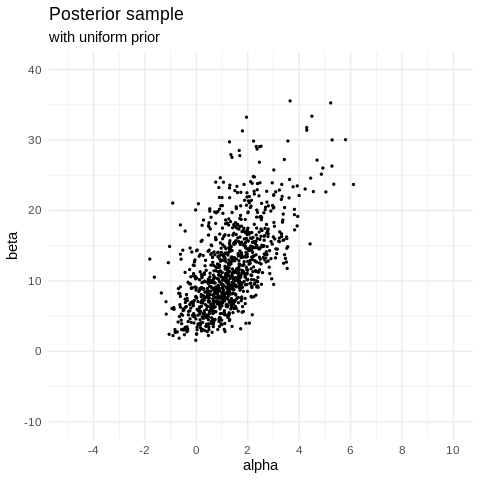<!-- -->

We can plot the samples as the resulting logistic model together with
the
data:

``` r
plot_samples <- function(sample, n=100, title="Posterior samples", subtitle="") {
  log.dose <- seq(-1.5, 1.5, length.out = 100)

  sample %>%
    sample_n(size=n) %>%
    mutate(id=1:n) %>%
    purrr::pmap_df(~tibble(log.dose=log.dose, id=..3,
                          prop=invlogit(..1 + ..2*log.dose))) %>%
    ggplot(aes(x=log.dose, y=prop)) +
    geom_line(aes(group=id), alpha=0.2, col="#377EB8") +
    geom_hline(yintercept=0.5, linetype='dashed', col="grey") +
    geom_point(data=d, col="#E41A1C") +
    theme_minimal() +
    labs(x="Dose (log g/ml)", y="Proportion of deaths",
         title=title, subtitle = subtitle)
}
plot_samples(post.sample)
```

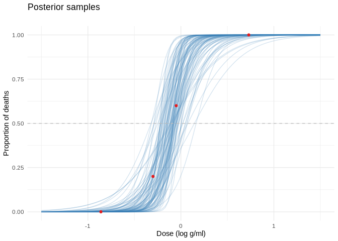<!-- -->

Note that we can also sample and visualize our prior distribution:

``` r
prior.sample <- extract.sample(post.grid, prior=TRUE)

prior.sample %>%
  ggplot(aes(x=alpha, y=beta)) +
  geom_point(size=0.5) +
  ylim(-10, 40) +
  scale_x_continuous(breaks=c(-4, -2, 0, 2, 4, 6, 8, 10), 
                     limits = c(-5, 10)) +
  theme_minimal() +
  labs(title="Prior sample")
```

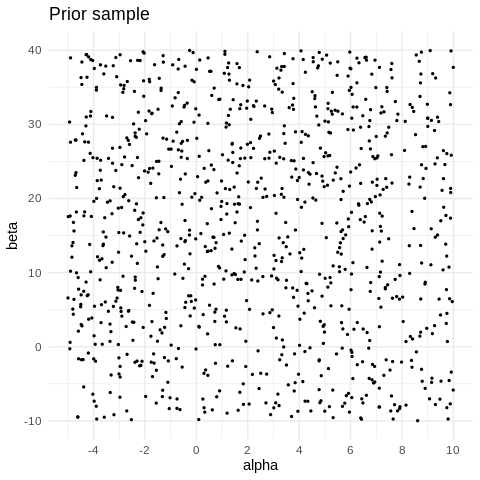<!-- -->

The prior is uniform and thus not very spectacular. For the logistic
model, this then looks as follows:

``` r
plot_samples(prior.sample, n=200, title="Prior samples")
```

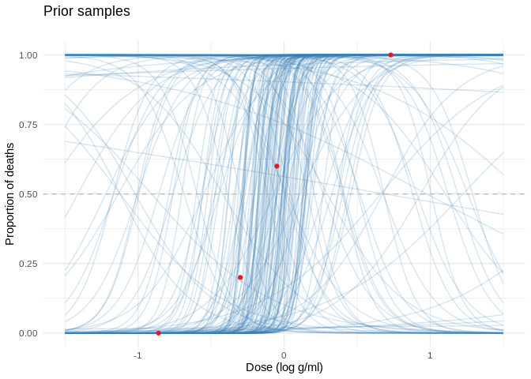<!-- -->

## Posterior Distribution of the LD50

We can use the posterior sample to compute the LD50 - the dose level at
which probability of death is 50%. In our logistic model, a 50% survival
rate means   
 = \\text{logit}^{-1}(\\alpha + \\beta x_i) = 0.5
\\end{align*}")  
Thus  = 0") and the LD50 is .

*Attention:* In this example, LD50 is a meaningless concept if , in which case increasing the dose does not cause the
probability of death to increase.

We report:

1)  The posterior probability that , that is, that the drug is harmful:

<!-- end list -->

``` r
mean(post.sample$beta > 0)
```

    [1] 1

From this, we can conclude that the posterior probability of  is roughly estimated to exceed 0.999.

2)  The posterior distribution for the LD50 conditional on . All draws had positive values of
    , so
    the distribution is given by the whole sample:

<!-- end list -->

``` r
LD50_samps <- post.sample %>%
  mutate( LD50 = - alpha / beta) 
LD50.mean <- LD50_samps %>%
  summarise(mean = mean(LD50))

unif.LD50.plot <- LD50_samps %>%
  ggplot(aes(x=LD50)) + 
  geom_histogram(bins=50, 
                 fill="#377EB8", col="white") +
  scale_y_continuous(labels = NULL, name="") +
  xlim(-0.6, 0.7) +
  geom_vline(data=LD50.mean, aes(xintercept=mean), col="#E41A1C") +
  theme_minimal() +
  labs(title="Posterior distribution for the LD50",
       subtitle="with uniform prior")
unif.LD50.plot
```

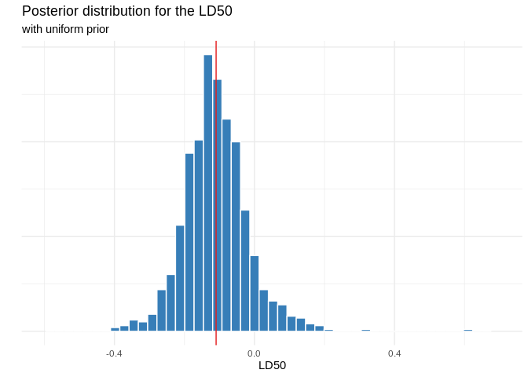<!-- -->

We can incorporate the LD50 data in the plot of the logistic model:

``` r
plot_samples(post.sample) +
  geom_point(data=LD50_samps[1:100,], 
             aes(x=LD50, y=0.5), alpha=0.3, size=0.5)
```

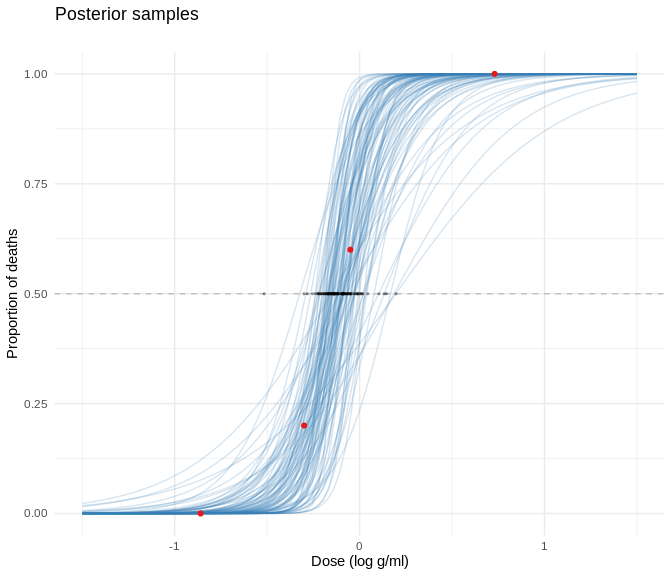<!-- -->

# A different prior

We want to replace the uniform prior density by a joint normal prior
distribution on ") with "), "), and =0.5").

``` r
mvn_prior <- function(alpha, beta) {
  rho <- matrix(c(2^2, 2*10*0.5, 2*10*0.5, 10^2), ncol=2)
  dmvnorm(c(alpha, beta), 
           mean=c(0, 10),
           sigma=rho)
}

prior.density <- function(grid, prior_fun){
  grid %>%
    rowwise %>%
    mutate(prior = prior_fun(alpha, beta)) %>%
    ungroup() %>%
    mutate(prior = prior / sum(prior)) 
}

mvn.prior.grid <- prior.density(post.grid, prior_fun=mvn_prior)
```

Our prior density then looks as follows:

``` r
mode <- max(mvn.prior.grid$prior)
breaks <- seq(0.05, 0.95, by=0.1) * mode

mvn.prior.grid %>%
  ggplot(aes(x=alpha, y=beta, z=prior)) + 
  stat_contour(breaks=breaks, col="#E41A1C") +
  ylim(-10, 40) +
  scale_x_continuous(breaks=c(-4, -2, 0, 2, 4, 6, 8, 10), 
                     limits = c(-5, 10)) +
  theme_minimal() +
  labs(title="Prior density")
```

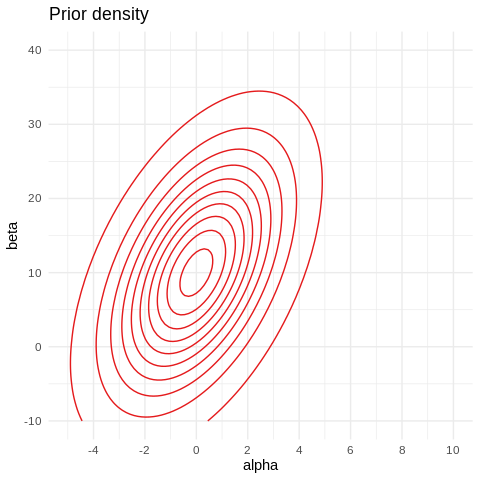<!-- -->

We can visualize the samples again:

``` r
prior.sample <- extract.sample(mvn.prior.grid, prior=TRUE)

prior_points <- prior.sample %>%
  ggplot(aes(x=alpha, y=beta)) +
  geom_point(size=0.5) +
  ylim(-10, 40) +
  scale_x_continuous(breaks=c(-4, -2, 0, 2, 4, 6, 8, 10), 
                     limits = c(-5, 10)) +
  theme_minimal() +
  labs(title="Prior sample", subtitle="with multivariate normal prior")

prior_model <- plot_samples(prior.sample, n=200, 
                            title="Prior sample", subtitle="with multivariate normal prior")
plot_grid(prior_points, prior_model)
```

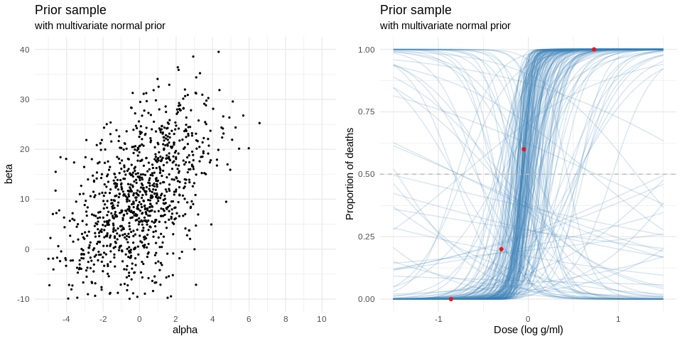<!-- -->

We can see that the prior still allows a wide range of different models
but different to the uniform prior, it is much more restricted to a
certain range that is already very close to the observed data.

## The new posterior density

We now use this prior to compute our posterior denstiy.

``` r
mvn.post.grid <- posterior.grid(post.grid, prior_fun=mvn_prior)
```

We can compare our new posterior density with the old posterior density
(obtained with a uniform prior)

``` r
mode <- max(mvn.post.grid$post)
breaks <- seq(0.05, 0.95, by=0.1) * mode

mvn_post_plot <- mvn.post.grid %>%
  ggplot(aes(x=alpha, y=beta, z=post)) + 
  stat_contour(breaks=breaks, col="#377EB8") +
  ylim(-10, 40) +
  scale_x_continuous(breaks=c(-4, -2, 0, 2, 4, 6, 8, 10), 
                     limits = c(-5, 10)) +
  scale_color_brewer(palette = "Set1", name="",
                     label=c("post"="posterior", "prior"), direction = -1) +
  theme_minimal() +
  labs(title="Posterior density", subtitle = "with multivariate normal prior")

plot_grid(unf_post_plot, mvn_post_plot)
```

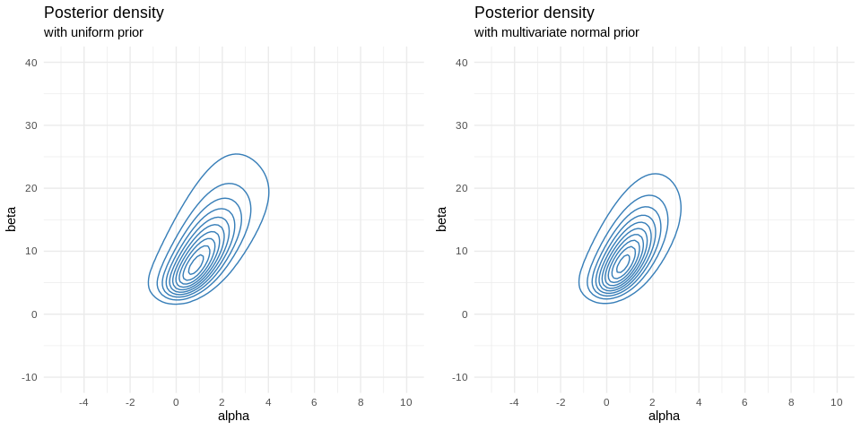<!-- -->

We can see that our new prior is slightly more regularizing than the
uniform prior: The new posterior density is a bit tighter than the old
posterior.

We can also compare the maximum a posteriori estimates: With the uniform
prior, we have as MAP estimate:

``` r
post.grid[which.max(post.grid$post),]
```

    # A tibble: 1 x 6
      alpha  beta loglkhd  prior log.post    post
      <dbl> <dbl>   <dbl>  <dbl>    <dbl>   <dbl>
    1 0.909  8.18   -5.90 0.0001    -5.90 0.00322

and with the multivariate normal posterior, we get:

``` r
mvn.post.grid[which.max(mvn.post.grid$post),]
```

    # A tibble: 1 x 6
      alpha  beta loglkhd    prior log.post    post
      <dbl> <dbl>   <dbl>    <dbl>    <dbl>   <dbl>
    1 0.758  8.18   -5.92 0.000613    -10.8 0.00403

While the beta value is the same (at least in our grid approximation),
the new posterior alpha is a bit closer to zero.

## Sampling from the new posterior

``` r
mvn.post.sample <- extract.sample(mvn.post.grid)
mvn.prior.sample <- extract.sample(mvn.prior.grid, prior = T)

post_plot <- mvn.post.sample %>%
  ggplot(aes(x=alpha, y=beta)) +
  geom_point(size=0.5) +
  ylim(-10, 40) +
  scale_x_continuous(breaks=c(-4, -2, 0, 2, 4, 6, 8, 10), 
                     limits = c(-5, 10)) +
  theme_minimal() +
  labs(title="Posterior sample", subtitle = "with multivariate normal prior")

prior_plot <- mvn.prior.sample %>%
  ggplot(aes(x=alpha, y=beta)) +
  geom_point(size=0.5) +
  ylim(-10, 40) +
  scale_x_continuous(breaks=c(-4, -2, 0, 2, 4, 6, 8, 10), 
                     limits = c(-5, 10)) +
  theme_minimal() +
  labs(title="Prior sample", subtitle = "with multivariate normal prior")

plot_grid(post_plot, prior_plot)
```

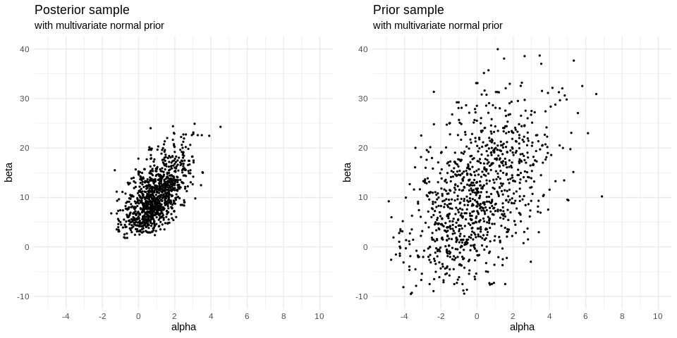<!-- -->

We again use the sample to visualize the posterior for the logistic
model:

``` r
plot_samples(mvn.post.sample) 
```

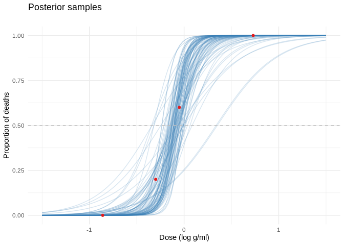<!-- -->

We can compare this again to the prior samples which also shows how the
posterior is a compromise between the data and the prior.

``` r
plot_samples(mvn.prior.sample) +
  labs(title="Prior samples")
```

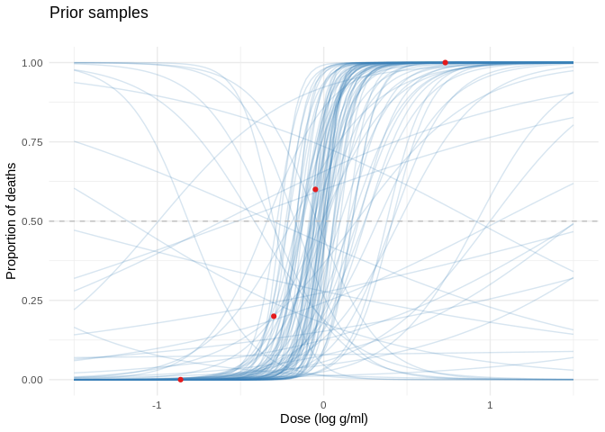<!-- -->

## New LD50

``` r
mvn.LD50_samps <- mvn.post.sample %>%
  mutate( LD50 = - alpha / beta) 

mvn.LD50.mean <- mvn.LD50_samps %>%
  summarise(mean = mean(LD50))

mvn.LD50.plot <- mvn.LD50_samps %>%
  ggplot(aes(x=LD50)) + 
  geom_histogram(bins=50, 
                 fill="#377EB8", col="white") +
  scale_y_continuous(labels = NULL, name="") +
  xlim(-0.6, 0.7) + 
  geom_vline(data=mvn.LD50.mean, aes(xintercept=mean), col="#E41A1C") +
  theme_minimal() +
  labs(title="Posterior distribution for the LD50", 
       subtitle="with multivariate normal prior")

plot_grid(mvn.LD50.plot, unif.LD50.plot)
```

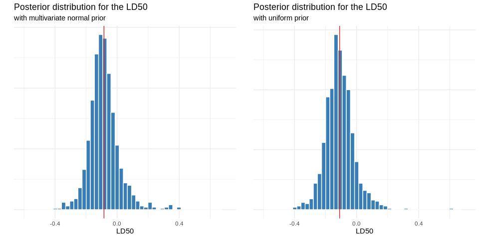<!-- -->

# Normal approximation of the posterior

The fourth chapter *Asymptotics and Non-Bayesian Approaches* explains
how it is possible to approximate the posterior distribution, using the
mode and a normal distribution. We will now compute the normal
approximation and compare it to the exact posterior obtained by the
uniform prior.

Since we assume a uniform prior density for "), the posterior mode is the same as the maximum
likelihood estimate. So we get the mode by computing the MLE:

``` r
# lkhd function
bioassayfun <- function(w, df) {
  z <- w[1] + w[2]*df$log.dose
  -sum(df$n.deaths*(z) - df$n.animals*log1p(exp(z)))
}

#' Optimize
w0 <- c(0,0)
optim_res <- optim(w0, bioassayfun, gr = NULL, d, hessian = T)
# w is the mode
w <- optim_res$par
# this computes the inverse of the hessian at the mode
S <- solve(optim_res$hessian)

#' Multivariate normal probability density function
dmvnorm <- function(x, mu, sig)
  exp(-0.5*(length(x)*log(2*pi) + log(det(sig)) + (x-mu) %*% solve(sig, x - mu)))

#' Evaluate likelihood at points (alpha, beta) 
ab_grid <- expand.grid(alpha = alpha_seq, 
                         beta = beta_seq ) 

ab_grid$lkhd <- apply(ab_grid, 1, dmvnorm, w, S)


#' Create a plot of the posterior density
norm_post_plot <- ggplot(data = ab_grid, aes(x = alpha, y = beta, z=lkhd)) +
  stat_contour( col="#377EB8") +
  ylim(-10, 40) +
  scale_x_continuous(breaks=c(-4, -2, 0, 2, 4, 6, 8, 10), 
                     limits = c(-5, 10)) +
  theme_minimal() +
  labs(x = 'alpha', y = 'beta',
       title="Posterior Density",
       subtitle="using normal Approximation" ) 

norm_post_plot
```

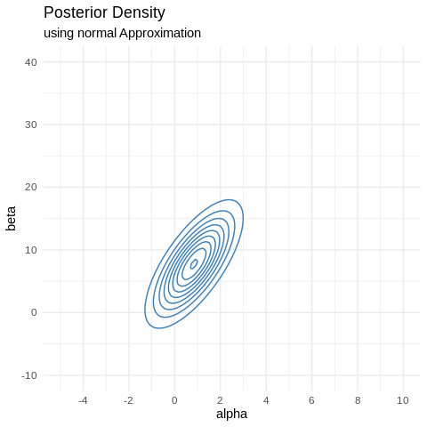<!-- -->

The posterior density is very similar to the one we obtained before, but
it is missing the slight skew in the upper corner.

Similarly for the posterior sample:

``` r
# sample from the multivariate model
norm_sample <- MASS::mvrnorm(N, w, S) %>%
  data.frame() %>%
  rename(alpha=X1, beta=X2)

norm_post_sample <- norm_sample %>%
  ggplot() +
  geom_point(aes(alpha, beta), size=0.5) +
  ylim(-10, 40) +
  scale_x_continuous(breaks=c(-4, -2, 0, 2, 4, 6, 8, 10), 
                     limits = c(-5, 10)) +
  theme_minimal() +
  labs(title="Posterior sample",
       subtitle="using normal approximation")
norm_post_sample
```

    Warning: Removed 1 rows containing missing values (geom_point).

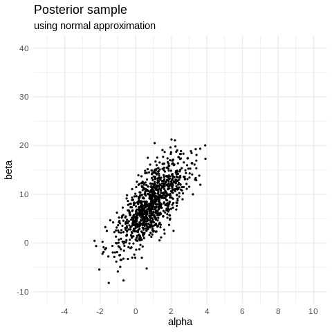<!-- -->

This also affects the resulting LD50 and the probability that :

``` r
mean(norm_sample$beta > 0)
```

    [1] 0.938

Before, this probability was ~1.

``` r
LD50_norm_samps <- norm_sample %>%
  filter( beta > 0 ) %>%
  mutate( LD50 = - alpha/beta )

LD50_norm_mean <- LD50_norm_samps %>%
  summarise(mean = mean(LD50))

norm.LD50.plot <- LD50_norm_samps %>%
  ggplot(aes(x=LD50)) + 
  geom_histogram(bins=50, 
                 fill="#377EB8", col="white") +
  scale_y_continuous(labels = NULL, name="") +
  xlim(-1, 1) +
  geom_vline(data=LD50_norm_mean, aes(xintercept=mean), col="#E41A1C") +
  theme_minimal() +
  labs(title="Posterior distribution for the LD50",
       subtitle="using normal approximation")

norm.LD50.plot
```

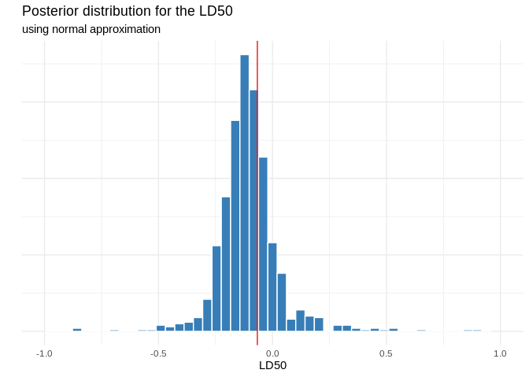<!-- -->

## Comparison

A direct comparison of the normal approximation with the exact posterior
makes the differences clearer:

``` r
#' Combine the plots
plot_grid(unf_post_plot, unf_post_sample, 
             unif.LD50.plot + xlim(-1, 1), norm_post_plot, 
             norm_post_sample, norm.LD50.plot, ncol = 3)
```

<!-- -->
